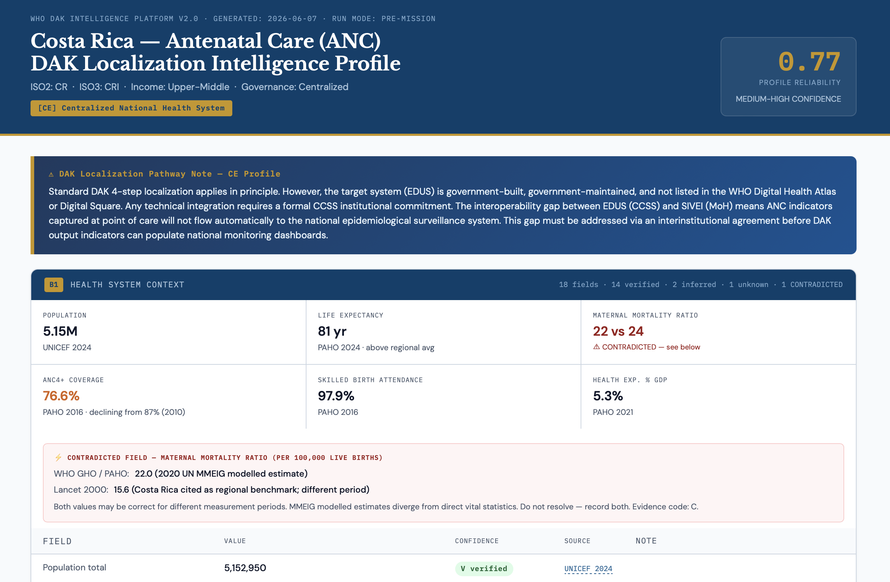

# WHO DAK Country Profile Skill

**A country health system profiler for WHO Digital Adaptation Kit (DAK) localisation.**

*Skill for global health · digital health · WHO SMART Guidelines · DAK adaptation · country assessment · health systems analysis · antenatal care · HIV · tuberculosis · immunization · health policy · Ministry of Health · digital health implementation · LMIC · health equity*

---

## What this skill does in one minute

You give it the name of a country and a health domain — for example, "Costa Rica + ANC" or "Zambia + Immunization".

It gives you back a structured profile of that country's health system, focused on what matters for adapting a WHO Digital Adaptation Kit to that specific context: who runs the health system, what digital systems are already in use, what the population health indicators look like, where the documented gaps are, and questions to ask the different stakeholders in the country that could help bridge those gaps.

Every fact in the profile is sourced. Every gap is named.

The output is meant to give you a fast, reliable starting point, the kind of country-context briefing that normally takes days of desk research, so that the conversations with stakeholders can begin from a shared evidence base.



*Example output for Costa Rica + ANC. The header summarises the country classification and overall profile reliability. Each value carries a source chip with confidence flag. The CONTRADICTED maternal mortality ratio (22 vs 24) is recorded with both sources rather than resolved, illustrating the skill's core epistemic principle: when reliable sources disagree, the contradiction is the finding.*

---

## Who this is for

This skill is designed to support the people who already do this work, by making the preparation phase faster and more transparent.

- **WHO technical officers** preparing for a country mission to localise a DAK.
- **Ministry of Health digital health focal points** wanting to assess their own country's readiness, or wanting to understand how their context is visible to international partners.
- **Implementing partners** (Global Fund, Gavi, PEPFAR programme leads, NGO digital health teams) needing a rapid, source-backed overview of a country before designing an intervention.
- **Health policy researchers** studying digital health implementation across countries, who need a structured, comparable starting point.
- **Academic researchers in global health informatics** working on country case studies or comparative analysis.
- **Anyone preparing a stakeholder meeting** about digital health in a specific country, who would benefit from arriving with a structured evidence map instead of unstructured notes.

The skill is not a clinical decision tool. It is not a final assessment. It is a starting point that requires human expert review, especially review by someone who knows the target country directly.

---

## What you get

When you run the skill, you receive:

**A readable profile in HTML**, a clean web page you can open in any browser, showing:

- Country classification (centralised, fragmented, donor-supported, sovereign, WHO-host paradox, or mixed)
- **Block 1 | health system context:** population, health expenditure, workforce, key domain indicators
- **Block 2 | digital landscape:** what EHR systems exist, who maintains them, real adoption rates, integration gaps
- Active risk flags with explanations and the questions each flag implies you should ask
- A list of Ministry of Health questions to bring to your first stakeholder meeting
- Every value carries a coloured source chip you can click to open the original source

**A compact JSON file:** a small machine-readable file (~55 tokens) that other tools or agents can use as input. This is useful if you want to feed the profile into another workflow.

**A reliability score:** a number between 0 and 1 telling you how complete and well-sourced the profile is, with a confidence label (HIGH, MEDIUM, LOW, INSUFFICIENT). This does not mean that it is not useful, but rather that it will generate more questions that need to be resolved with the final stakeholders, given that the information available on the internet is scarce.

---

## How it works (the short version)

The skill works in two stages.

**Stage 1: epidemiological profile.** It retrieves the country's key health indicators for the chosen DAK domain from open institutional sources: WHO, UNICEF, World Bank, PAHO, Global Fund. It records exactly where each value came from, what year it is, and how reliable that source is.

**Stage 2: digital landscape.** Using what Stage 1 found, it then maps the country's digital health systems: what EHR is in use, whether it connects to the national health management information system, what donors are funding what platforms, and what gaps exist between what official sources claim and what peer-reviewed literature documents.

After every government source, the skill is required to run an additional search in peer-reviewed literature, because official portals tend to report successes and omit implementation problems. If a country's data is too sparse to do this honestly (for example, a fragile state with surveys from 2013), the skill stops and produces an explicit gap map instead of fabricating an analysis.

---

## Design principles

The skill is built on five commitments that shape every decision in the code:

**Evidence gaps are first-class outputs.** When something cannot be verified, the skill says so explicitly with a documented list of sources it tried. A field marked as unknown with documented attempts is more useful than a fabricated value.

**Data sovereignty is a structural input.** Countries have different data laws, different institutional arrangements, and different digital health architectures. The skill adapts its search strategy to each country instead of forcing all countries through the same retrieval template.

**Operational heuristics are never promoted to verified facts.** When the skill predicts (for example) that a country with an active Global Fund grant likely uses DHIS2, this prediction is labelled as a probabilistic correlation requiring verification. It never enters the profile as a confirmed finding.

**Government sources are cross-checked against peer-reviewed literature.** National portals systematically suppress adoption failures, integration gaps, and implementation problems. After every official source, the skill is required to query peer-reviewed literature to surface what official documentation omits.

**The skill augments expert judgement, it does not replace it.** Every output requires review by someone who knows the country, preferably someone who lives and works in it. The profile is a structured starting point for stakeholder conversations, not a substitute for them.

These principles are a response to documented inequities in how health systems of low- and middle-income countries appear in global digital health data (Quintana et al., 2023). Making absence explicit, surfacing what official sources omit, and treating country context as a structural input are how the skill tries to support more equitable representation of health systems in this digital age.

---

## How to install — the friendly version

If you have never installed a skill before, do not worry. Here are the three most common ways.

### Option 1: Use it inside Claude (easiest)

If you have a Claude.ai paid account, you can use this skill as a Claude Project.

1. Open Claude.ai and create a new Project.
2. In Project Instructions, paste the contents of the file `SKILL.md` from this repository.
3. In Project Knowledge, upload the six YAML files from the `config/` folder of this repository.
4. Start a conversation with your project. Type, for example: `Costa Rica + ANC` or `Zambia + Immunization`.

The skill will run automatically and produce the profile.

### Option 2: Use it from a terminal (intermediate)

If you are comfortable opening a terminal, you can clone the repository and run it as a Python project.

You need Python 3.10 or newer. To install:

```bash
git clone https://github.com/marionneblancoherrera-coder/Who-Country-Profile.git
cd Who-Country-Profile
pip install pyyaml
pip install pypdf
python retrieval/preflight.py --require-network
```

If preflight passes, the skill is ready. You can then run it from Python following the examples in the `intelligence/` folder.

### Option 3: Use it inside Claude Code (for developers)

If you use Claude Code or similar agent platforms, you can install this repository as a skill following the Anthropic Agent Skills standard. The `SKILL.md` file at the root of the repository is the entry point.

### If you get stuck

Open an issue in this repository describing what you tried and what happened. The skill is intended to be usable by people whose primary expertise is health systems, not software. If a step is confusing, that is feedback worth receiving.

---

## What the skill is not

- This skill is **not a clinical decision tool**. It does not advise on patient care.
- It is **not a final country assessment**. It is a starting point that must be reviewed and corrected by experts with direct country knowledge.
- It is **not a replacement for stakeholder consultation**. It is designed to make stakeholder consultations more productive by giving everyone in the room a shared evidence base.
- It **does not generate data**. It retrieves, structures, and cross-checks data from open institutional sources. If a fact is not in those sources, the skill will not invent it.
- It **may miss documents in non-English languages**, because its current retrieval queries primarily in English. National clinical guidelines published in the country's own language may not be surfaced.
- It **depends on the quality of open sources**. When official portals are unavailable or out of date, the skill flags this transparently rather than hiding it, but the underlying data limitation remains.

---

## How to interpret the output responsibly

When you read a profile produced by this skill, please:

- Treat every value as something to verify, not something to accept.
- Pay attention to the confidence flags (V, VA, I, IW, U, C).
- Read the unknowns. A field marked unknown is telling you where to look next.
- If you know the country directly, expect to find things the skill got wrong or missed. That is normal and expected. The skill is an automated first pass.
- Bring the Ministry of Health questions to your actual stakeholder meeting and update the profile based on what you learn.

### Confidence flags

| Code | Meaning | Source type |
|------|---------|-------------|
| **V** | Verified | WHO/UN Tier 1, ≤ 2 years |
| **VA** | Verified academic | Q1 peer-reviewed, ≤ 3 years |
| **I** | Inferred | Government portal or derived |
| **IW** | Inferred-weak | Stale or grey literature |
| **U** | Unknown | Attempted — not found |
| **C** | CONTRADICTED | Two Tier 1/2 sources disagree |

---

## A note on collaboration

This skill was developed as a final project for the course **Natural Language Processing for Business and Finance (Spring 2026)**, under the supervision of **Professor Lonneke van der Plas** (Daccò Chair in Natural Language Processing, USI NLP Lab) at Università della Svizzera italiana, in collaboration with the **World Health Organization** as external partner: **Natschja Ratanaprayul**, Technical Officer, Digital Health and Information Systems Unit, WHO SMART Guidelines.

The skill was built by a single author, **Marionne Blanco Herrera**, a Costa Rican medical doctor pursuing a Master's degree in Health Communication at USI, working from published literature on WHO DAK implementation. It has not yet been co-developed with WHO technical officers, Ministry of Health stakeholders, or health workers in the countries it can profile.

If you work in WHO digital health, in a Ministry of Health digital health unit, in a DAK implementation team, or in any role that touches this workflow, please open an issue, write a comment, or contribute. The skill becomes more accurate, more useful, and more honest when shaped by the people whose work it tries to support.

---

## Anatomy of the Skill
who-country-profile/
    ├── SKILL.md (required)
    │   ├── YAML frontmatter (name, description, license, compatibility, metadata)
    │   └── Markdown instructions (purpose, when to use, workflow, output format, safety rules)
    │
    ├── config/                          Six YAML files — all logic externalized
    │   ├── country_taxonomy.yml         Six structural dimensions + fragmentation index
    │   ├── domain_indicators.yml        Universal + DAK-specific indicators (ANC, HIV, TB, Immunization)
    │   ├── donor_signals.yml            Donor-to-system probabilistic heuristics
    │   ├── evidence_rules.yml           Evidence types, cross-check rules, official silence policy
    │   ├── risk_definitions.yml         14 risk flags (5 base + 9 emergent) + mandatory MoH questions
    │   └── source_hierarchy.yml         Source types, confidence model, retrieval states
    │
    ├── intelligence/                    Deterministic pipeline (executes before any LLM call)
    │   ├── classifier.py                Country classification into six structural categories
    │   ├── domain_router.py             Domain-specific indicator routing per DAK
    │   ├── evidence_classifier.py       Confidence flags (V, VA, I, IW, U, C) per field
    │   ├── priming_engine.py            Block 1 → Block 2 priming + B2 gate enforcement
    │   └── risk_assessor.py             Risk flag evaluation + MoH question generation
    │
    ├── retrieval/                       Open-source data fetching layer
    │   ├── http_client.py               HTTP client with retry logic and error classification
    │   ├── pdf_handler.py               PDF download, deduplication (SHA-256), text extraction
    │   ├── manifest_loader.py           Loads agent-discovered source URLs from JSON manifest
    │   ├── document_ingester.py         User PDFs, URLs, RAG payloads, WHO MCP stub
    │   ├── retrieval_states.py          State machine constants for source lifecycle
    │   └── preflight.py                 Environment and network checks before retrieval
    │
    ├── sources/                         Source catalogues and query templates
    │   ├── source_catalog.yml           What sources exist and what they can provide
    │   ├── retrieval_strategy.yml       Which sources to use per country profile
    │   ├── query_templates.yml          PubMed query templates per retrieval intent
    │   ├── category_catalog.yml         URL sequences per country category
    │   ├── domain_catalog.yml           DAK domain metadata, patient pathways, equity dimensions
    │   └── baseline_indicators.json     Controlled baseline indicators for deterministic retrieval
    │
    ├── scoring/                         Reliability and quality gates
    │   ├── reliability_formula.py       Weighted deterministic score (0-1) across both blocks
    │   └── assertions.py                Ten Level 1 assertions — output blocked if any fail
    │
    ├── outputs/                         Formatted profile generation
    │   ├── html_renderer.py             Human-readable HTML with clickable source chips
    │   └── compact_writer.py            Compact JSON (~55 tokens) for downstream agents
    │
    ├── evals/                           Evaluation framework
    │   ├── rubrics/
    │   │   └── judge_prompt.md          LLM-as-judge rubric (12 dimensions)
    │   ├── golden/
    │   │   ├── zambia_anc.json          Standard target country case
    │   │   └── costa_rica_anc.json      Centralized sovereign EHR case
    │   └── adversarial/
    │       └── yemen_anc.json           Fragile state graceful degradation case
    │
    ├── run_output/                      Generated profiles (per-country directories)
    │
    ├── README.md                        Project overview, installation, design principles
    ├── CHANGELOG.md                     Version history (v1.0.0 → v2.0.0)
    └── LICENSE                          Apache 2.0

## References

- Mehl, G., Tunçalp, Ö., Ratanaprayul, N., et al. (2021). WHO SMART guidelines: optimising country-level use of guideline recommendations in the digital age. *Lancet Digital Health*, 3(4), e213–e215.
- Muliokela, R., et al. (2022). Integration of new digital antenatal care tools using the WHO SMART guideline approach: experiences from Rwanda and Zambia. *Digital Health*, 8.
- Muliokela, R. K., et al. (2025). Implementation of WHO SMART Guidelines—Digital Adaptation Kits in Pathfinder Countries in Africa: Processes and Early Lessons Learned. *JMIR Medical Informatics*, 13, e58858.
- Tamrat, T., Ratanaprayul, N., Barreix, M., et al. (2022). Transitioning to Digital Systems: The Role of WHO's Digital Adaptation Kits. *Global Health: Science and Practice*, 10(1).
- Quintana, Y., Cullen, T. A., Holmes, J. H., Joshi, A., Novillo-Ortiz, D., & Liaw, S.-T. (2023). Global Health Informatics: the state of research and lessons learned. *Journal of the American Medical Informatics Association*, 30(4), 627–633.
- Zhang, B., Lazuka, K., & Murag, M. (2025, October 16). *Equipping agents for the real world with Agent Skills*. Anthropic Engineering. https://www.anthropic.com/engineering/equipping-agents-for-the-real-world-with-agent-skills
- Anthropic (2025). *skill-creator: SKILL.md*. anthropics/skills repository. https://github.com/anthropics/skills/blob/main/skills/skill-creator/SKILL.md

---

## License

Apache 2.0 — see [LICENSE](LICENSE)
